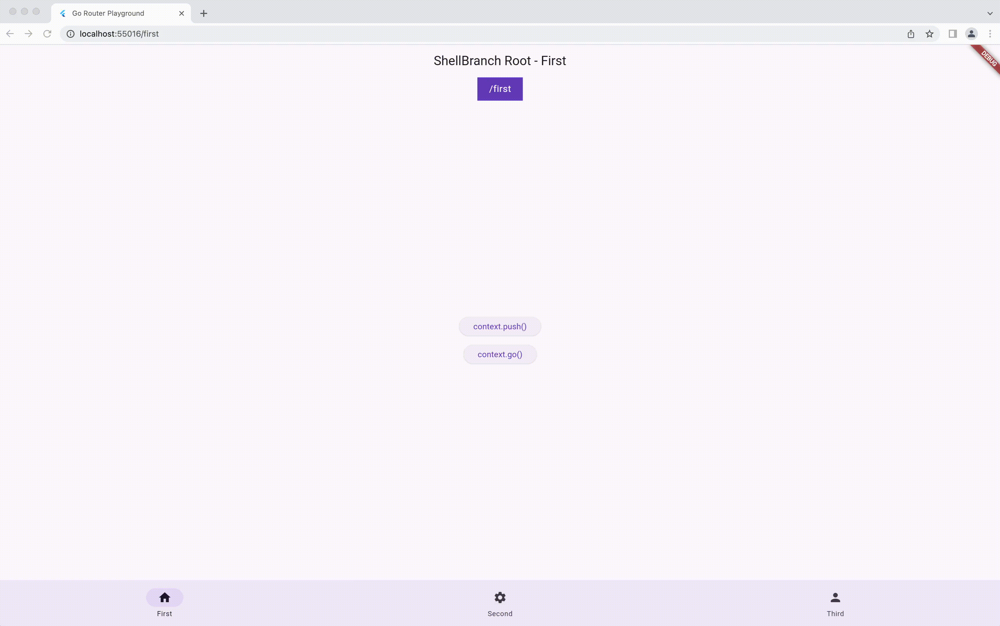
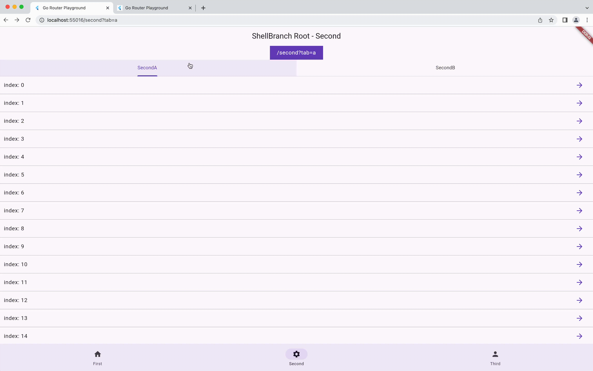
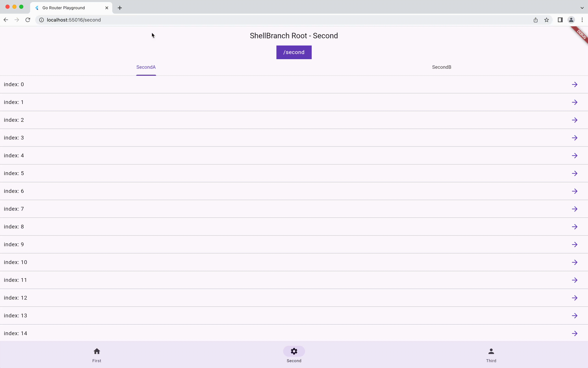

# go_router_playground

This is a playground by using [go_router](https://pub.dev/packages/go_router) and [go_router_builder](https://pub.dev/packages/go_router_builder).

| Feature | Demo |
|--------|--------|
| StatefullShellRoute |  |
| PathParameters |  |
| QueryParameters |  |

## References

- Andrea氏の記事
  - [Flutter Bottom Navigation Bar with Stateful Nested Routes using GoRouter](https://codewithandrea.com/articles/flutter-bottom-navigation-bar-nested-routes-gorouter/)
- `go_router`サンプル
  - https://github.com/flutter/packages/tree/main/packages/go_router/example/lib
- `go_router_builder`サンプル
  - https://github.com/flutter/packages/tree/main/packages/go_router_builder/example/lib
